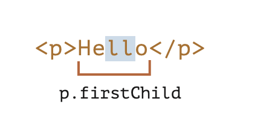

### 一、**`Range`** 

Range表示一文档的一个片段，这个片段可容纳节点或者是文本节点。简单来说，我们可以通过Range对象来对节点或者是文本节点就行选择。

二、通过Range来选择部分片段

```js
let` range `=` `new` `Range``(``)``;

```

然后，我们可以使用 range.setStart(node, offset) 和 range.setEnd(node, offset) 来设置选择边界。

有趣的是，这两种方法中的第一个参数 `node` 都可以是文本节点或元素节点，而第二个参数的含义依赖于此。

**如果 `node` 是一个文本节点，那么 `offset` 则必须是其文本中的位置。**

例如，对于给定的 `<p>Hello</p>`，我们可以像下面这样创建一个包含字母 “ll” 的范围：

```js
<p id="p">Hello</p>
<script>
  let range = new Range();
  range.setStart(p.firstChild, 2);
  range.setEnd(p.firstChild, 4);

  // 对 range 进行 toString 处理，range 则会把其包含的内容以文本的形式返回
  console.log(range); // ll
</script>
```

在这里，我们获取 `<p>` 的第一个子节点（即文本节点）并指定其中的文本位置：


