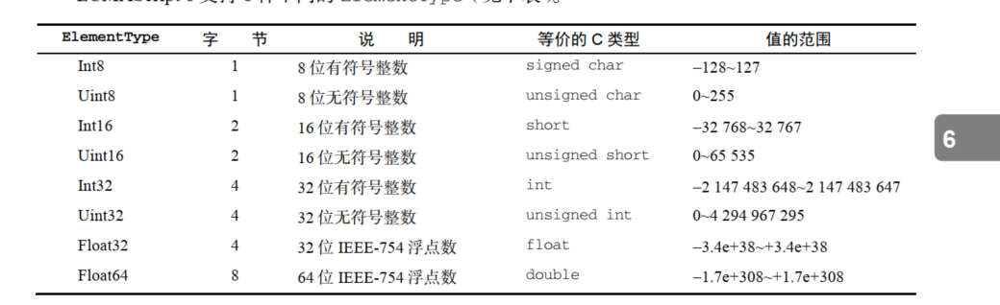

### 一、Proxy

**Proxy** 对象用于创建一个对象的代理，从而实现基本操作的拦截和自定义（如属性查找、赋值、枚举、函数调用等）。

看下面的例子

```js
let target = { x: 10,y: 20};
let hanler = { get: (obj, prop) => 42};
let p=new Proxy(target,hanler)
console.log(target.x)  10
console.log(p.x)   42


target是要使用 Proxy 包装的目标对象（可以是任何类型的对象，包括原生数组，函数，甚至另一个代理）。
//注意，这里我们读取p.x能够读取到，是因为这里，p就是target的代理对象，这样我们在处理一些东西的时候能够保护原始对象，无论p的值怎么改变，都不会改变原始对象的值
```

### 二、数组相关

#### 1、定型数组（typed array）

定型数组指的是一种特殊的包含数值类型的数组。了解定型数组之前我们先了解两个与定型数组有关的概念

**1.1  ArrayBuffer**

ArrayBuffer 对象用来表示通用的、固定长度的原始二进制数据缓冲区。ArrayBuffer（）构造函数用来在内存中分配特定数量的字节空间。

```js
 const arrayBuffer=new ArrayBuffer(16)  //在内存中分配16字节
 console.log('arrayBuffer',arrayBuffer.byteLength)//16


ArrayBuffer一经创建就不能再调整大小。不过，可以使用 slice()复制其全部或部分到一个新实例中：
例中：
const buf1 = new ArrayBuffer(16)
const buf2 = buf1.slice(4, 12);
alert(buf2.byteLength); // 8
```

不能仅通过对 ArrayBuffer 的引用就读取或写入其内容。要读取或写入 ArrayBuffer，就必须通过视图。视图有不同的类型，但引用的都是 ArrayBuffer 中存储的二进制数据。  


**1.2 DataView**

第一种允许你读写 ArrayBuffer 的视图是 DataView。这个视图专为文件 I/O 和网络 I/O 设计，其
API 支持对缓冲数据的高度控制，但相比于其他类型的视图性能也差一些。 DataView 对缓冲内容没有
任何预设，也不能迭代。

```js
/* 默认情况下DataView使用整个ArrayBuffer */ 
 
const arrayBuffer=new ArrayBuffer(16)
 const fullDataView=new DataView(arrayBuffer)
 console.log('byteOffset',fullDataView.byteOffset) //0
 console.log('buffer',fullDataView.buffer===arrayBuffer) //true
 console.log('byteLength',fullDataView.byteLength) //16
/* DataView构造函数还可以接受一个字节偏移量和字节长度 */ 

 const firstHalfDataView = new DataView(arrayBuffer, 0, 8);
 console.log(firstHalfDataView.byteOffset); // 0
 console.log(firstHalfDataView.byteLength); // 8
console.log(firstHalfDataView.buffer === arrayBuffer); // true


```

**字节和比特**

  位（bit）：也被称为比特，二进制数中的一个数位，可以是0或者1，是计算机中数据的最小单位。二进制的一个“0”或一个“1”叫一位。

字节（Byte，B）：计算机中数据的基本单位，每8位组成一个字节。各种信息在计算机中存储、处理至少需要一个字节。

**ElementType**

DataView 对存储在缓冲内的数据类型没有预设。它暴露的 API 强制开发者在读、写时指定一个ElementType，然后 DataView 就会忠实地为读、写而完成相应的转换。




DataView 为上表中的每种类型都暴露了 get 和 set 方法，这些方法使用 byteOffset（字节偏移量）定位要读取或写入值的位置。类型是可以互换使用的，如下例所示：

```js

const arrayBuffer=new ArrayBuffer(2)

const view=new DataView(arrayBuffer)
console.log(view.getInt8(0))  //0
console.log(view.getInt8(1))   //0
console.log(view.getInt16(0))   //0
console.log(view.getInt16(1)) //Uncaught RangeError: Offset is outside the bounds of the DataView


//在上面，2个字节，对应的是8比特是两个，对应的16比特只有1个，因此我们打印view.getInt16(1)的时候回报错，因为两个字节我们用1个16位就能表示，不存在第二个16位
```

#####   补充：进制转换


比如0X80为16进制，则转换二进制遵循以下方法

因为：2<sup>4</sup>=16 所以每个位数对应的是4位

对应的四位数为：8、4、2、1 ，之所以是8、4、2、1是因为8+4+2+1=15。8、4、2、1也就是2<sup>3</sup>=8、2<sup>2</sup>=4、2<sup>1</sup>=2、2<sup>0</sup>=1


二进制与十进制之间的转换

找出最近的二的次幂，依次叠加

比如34转换成二机制，离34最近的为2<sup>5</sup>=32   

### 三、Class（类）

#### 1、类的概念

上面代码定义了一个“类”，可以看到里面有一个`constructor()`方法，这就是构造方法，而`this`关键字则代表实例对象。ES6当中的类可以把它看作是ES5当中的语法糖。是对new这种构造函数的简化。

```javascript
class Point {
  constructor(x, y) {
    this.x = x;
    this.y = y;
  }

  toString() {
    return '(' + this.x + ', ' + this.y + ')';
  }
}
```

#### 2、constructor 方法

```javascript
import axios from 'axios'
import type { AxiosInstance, AxiosRequestConfig } from 'axios'

class Request {
  // axios 实例
  instance: AxiosInstance

  constructor(config: AxiosRequestConfig) {
    this.instance = axios.create(config)
  }
  request(config: AxiosRequestConfig) {
    return this.instance.request(config)
  }
}

export default Request

//在上文当中，我们创建了一个request的类，其中有有个constructor方法，对于所有的class都必然有个constructor方法，在对class进行实例化的时候，第一步就是通过constructor方法生成实例。比如，new Request（）的时候，第一步就是调用constructor方法生成实例。

//注意：在我们定义类的时候，所有类如果我们没有给他添加construtor方法的话，都会被默认添加一个constructor方法

class Point {
}

// 等同于
class Point {
  constructor() {}
}

上图中pointer被默认添加了constructor方法。
（1）constructor()方法默认返回实例对象（即this），完全可以指定返回另外一个对象。

（2）类必须使用new调用，否则会报错


class Foo {
  constructor() {
    return Object.create(null);
  }
}

Foo()
```

#### 3、类的实例


（1）用new操作符是调用函数的的时候返回的是类的实例。

（2）类的实例除非显式定义在其本身（即定义在`this`对象上），否则都是定义在原型上（即定义在`class`上）。

```js
//定义类
class Point {

  constructor(x, y) {
    this.x = x;
    this.y = y;
  }

  toString() {
    return '(' + this.x + ', ' + this.y + ')';
  }

}

//在我们上面定义的Point类中，除了x、y是在实例当中的，toString会被定义在原型上面
var point = new Point(2, 3);

point.toString() // (2, 3)

point.hasOwnProperty('x') // true
point.hasOwnProperty('y') // true
point.hasOwnProperty('toString') // false
```

#### 4、getter和setter

```js
class MyClass {
  constructor() {
    // ...
  }
  get prop() {
    return 'getter';
  }
  set prop(value) {
    console.log('setter: '+value);
  }
}

let inst = new MyClass();

inst.prop = 123;
// setter: 123

inst.prop
```

##### 5、static静态方法与静态属性

类相当于实例的原型，所有在类中定义的方法，都会被实例继承。如果在一个方法前，加上`static`关键字，就表示该方法不会被实例继承，而是直接通过类来调用，这就称为“静态方法”。

```javascript
class Foo {
  //定义了静态方法
  static classMethod() {
    console.log(this.test)   //输出结果为1，这里面的this指的是类本身
     return 'hello';
  }
}

Foo.classMethod() // 'hello'
//定义静态属性
Foo.test=1 //静态方法只允许这样定义，static关键字定义在类内部只能允许静态方法那样定义
var foo = new Foo();
foo.classMethod() // TypeError: foo.classMethod is not a function   
//方法是定义在Class上面的静态方法，所以实例化不能调用，只能这个类本身调用，这里还要注意，如果静态方法上面使用了this。则这个this指向的类，而不是实例对象
```

