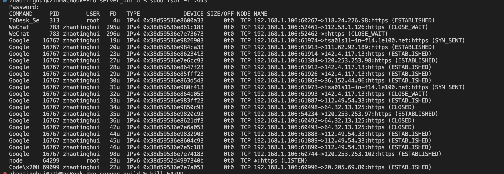

如何关闭node服务进程（ma c）

sudo lsof -i :port  列出改端口下面的所有进程

如上面的命令是所有443端口占用情况

找到进程对应的pid，然后杀死进程 

kill -9 64299  -9代表的是强制杀死进程。 ，mac不可以加上sudo

git log --author="zhaotinghui2_wd" --since=2023-08-01 --until=2023-08-31 --pretty=tformat: --numstat | awk '{ add += $1; subs += $2; loc += $1 - $2 } END { printf "added lines: %s, removed lines: %s, total lines: %s\n", add, subs, loc }' -
