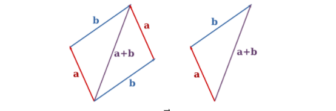
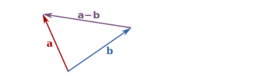
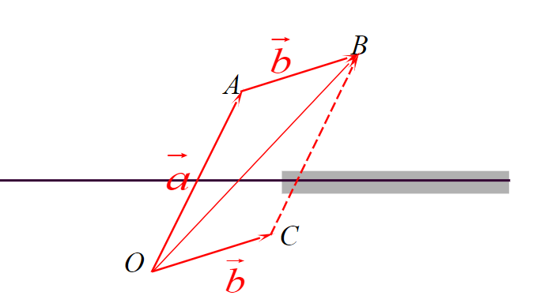

# 一、向量

### 1、向量的基本概念

**向量：**指一个同时具有大小和方向，且满足平行四边形法则的几何对象。

**向量的模：**向量的**大小**（Magnitude）也称**模长**、**长度**。几何上，当确定了单位长度后作图所得的向量的长度，即为向量的大小，记作$ \vec v $。在有限维赋范线性空间中，向量的模长也称为范数（Norm）。已知向量的坐标，就可以知道它的模长。

**向量相等：**如果$\vec a$与$\vec b$大小和方向和均相同，则$\vec a$与$\vec b$相等，向量的相等意味着向量有平移不变性。

**零向量：**始点与终点重合，即大小为0的向量，被称为**零向量**（Zero vector），记以数字0上加箭头，即$\vec 0$。在坐标表示下，不论含有多少分量，不论指向任何方向，若所有的分量均为0的向量即为零向量。关于零向量有两点值得一提：

（1）零向量依旧具有**方向性**，但方向不定。因此，零向量与任一向量平行。

（2）零向量不等于数量0，它们是两种性质完全不同的对象，即即$\vec 0$≠0。

### 2、向量的运算

#### 2.1 向量加法

向量的加法满足[平行四边形法则](https://zh.wikipedia.org/wiki/平行四邊形恆等式)和[三角形法则](https://zh.wikipedia.org/wiki/三角不等式#向量)。具体地，两个向量$\vec a$和$\vec b$相加，得到的是另一个向量。这个向量可以表示为$\vec a$和$\vec b$的起点重合后，以它们为邻边构成的平行四边形的一条对角线（以共同的起点为起点的那一条，见下图左），或者表示为将$\vec a$的终点和$\vec b$的起点重合后，从$\vec a$的起点指向$\vec b$的终点的向量，入下图所示：

设向量$\vec a$=（a~1~、a~2~、a~3~），$\vec b$=（b~1~、b~2~、b~3~）

则$ \vec a + \vec b$=（a~1~+b~1~、a~2~+b~2~、a~3~+b~3~）

加法运算律：(1)$ \vec a + \vec b$=$  \vec b+\vec a $  交换律

​					（2）$ \vec a + \vec b+\vec c$=$ \vec a + \vec b$=$ \vec a + (\vec b+\vec c)$    结合律

​					（3）$ \vec a + \vec 0$=$ \vec a $

​					（4）$ \vec a + （-\vec a）$=$\vec 0$

#### 2.2  向量的减法

两个向量$\vec a$和$\vec b$的相减，则可以看成是向量$\vec a$加上一个与$\vec b$大小相等，方向相反的向量。又或者$\vec a$和$\vec b$的相减得到的向量可以表示为$\vec a$和$\vec b$的起点重合后，从$\vec b$的终点指向的$\vec a$终点的向量：

设向量$\vec a$=（a~1~、a~2~、a~3~），$\vec b$=（b~1~、b~2~、b~3~） 定义-$\vec a$=（-a~1~、-a~2~、-a~3~），$\vec b$=（b~1~、b~2~、b~3~）

则$ \vec b$-$\vec a$=$ \vec b$+（-$ \vec a$）=（b~1~-a~1~、b~2~-a~2~、b~3~-a~3~）

若空间中两点：A（X~1~、Y~1~、Z~1~）、B（X~2~、Y~2~、Z~2~）。

则$\overrightarrow{AB}$=$\overrightarrow{OB}-\overrightarrow{OA}$=（X~2~-X~1~、Y~2~-Y~1~、Z~2~-Z~1~）

#### 

$ \vec a · \vec b= \left(\begin{array}{cc} x_a\\ y_a\end{array}\right)·\left(\begin{array}{cc} x_b\\ y_b\end{array}\right)=x_ax_b+y_ay_b$

(2)三维坐标系下向量的点乘

$ \vec a · \vec b= \left(\begin{array}{cc} x_a\\ y_a\\z_a\end{array}\right)·\left(\begin{array}{cc} x_b\\ y_b\\ z_b\end{array}\right)=x_ax_b+y_ay_b+z_az_b$

# 二、矩阵

1、矩阵的定义

将一些元素排列成若干行，每行放上相同数量的元素，就是一个矩阵。这里说的元素可以是数字，例如以下的矩阵：

A=$ \begin{bmatrix}0&1&1\\
1&1&0\\
1&0&1\\
\end{bmatrix}$

2、矩阵的乘法

并不是所有的矩阵都可以相乘的，两个矩阵的乘法仅当第一个矩阵A的列数(column)和另一个矩阵B的行数(row)相等时才能定义。比如

$ \begin{bmatrix}1&0&2\\
-1&3&1\\
\end{bmatrix}$×$ \begin{bmatrix}3&1\\2&1\\1&0\\\end{bmatrix}$=$ \begin{bmatrix}(1×3+0×2+2×1)&(1×1+0×1+2×0)\\(-1×3+3×2+1×1)&(-1×1+3×1+1×0)\\\end{bmatrix}$=$\begin{bmatrix}5&1\\4&2\\\end{bmatrix}$

矩阵的乘法就像上面我们看到的一样，比如，一个2×3的矩阵和一个3×2的矩阵才可以相乘，相乘的结果就是一个2×2的矩阵，其中结果，比如，2×2矩阵的第一行第一列，结果就是取2×3矩阵的第一个行，乘以3×2矩阵的第一列
